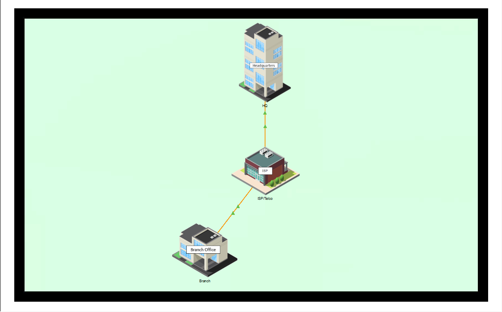
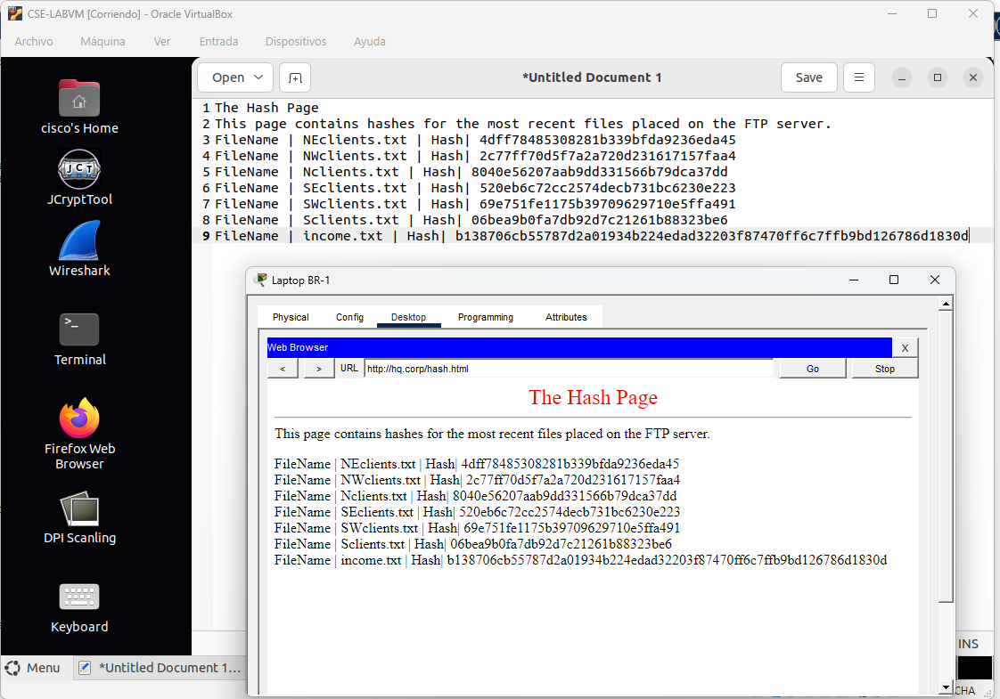
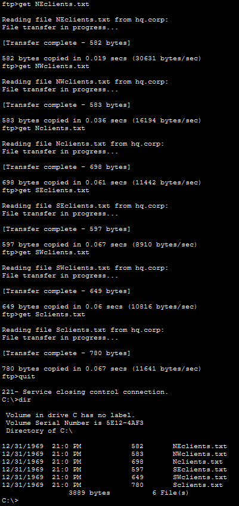
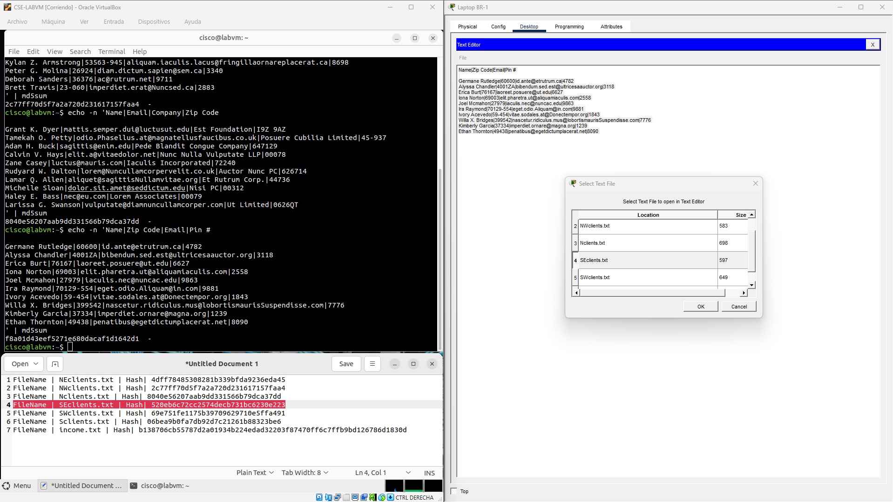
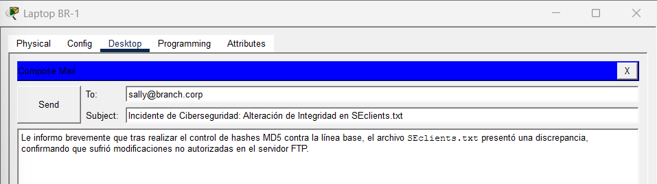
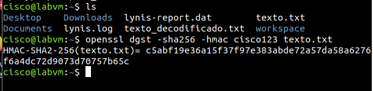

# Laboratorio: Verificación de la Integridad de Datos y Archivos

## 📌 Descripción General

En este laboratorio práctico de ciberseguridad y redes se analiza la **integridad de la información** (uno de los pilares fundamentales de la **Tríada CIA**) en un escenario posterior a un incidente de seguridad. 

Se evalúan técnicas de hashing estándar (**MD5**) para detectar manipulación no autorizada (*data tampering*) en archivos almacenados en un servidor FTP, se simula el proceso de **escalado y respuesta ante incidentes (IR)**, y se implementa **HMAC-SHA256** mediante herramientas de línea de comandos en Linux para garantizar autenticidad e integridad en documentos financieros sensibles.

---

## 🎯 Objetivos de la Práctica

* **Recuperar y analizar** archivos mediante servicios de transferencia (FTP) en un entorno de red simulado.
* **Validar la integridad** de archivos comparando hashes MD5 locales contra una línea base (*baseline*) archivada en un servidor web.
* **Identificar y aislar** evidencia digital comprometida por un actor malicioso.
* **Simular la notificación de incidentes** a través de canales de correo corporativo internos.
* **Implementar HMAC-SHA256** utilizando `openssl` en Linux para garantizar integridad con autenticación precompartida.

---

## 🛠️ Tecnologías y Herramientas Utilizadas

| Categoría | Herramienta / Protocolo | Uso en el Laboratorio |
| :--- | :--- | :--- |
| **Simulador de Red** | Cisco Packet Tracer | Modelado de topología con sucursal (Branch) y sede central (HQ) |
| **Sistema Operativo** | Linux (CSE-LABVM) | Entorno de auditoría e inspección criptográfica |
| **Protocolos** | FTP, HTTP, SMTP | Transferencia de archivos, consulta de hashes base y notificación por email |
| **Herramientas CLI** | `md5sum`, `openssl`, `ftp` | Cálculo de digests MD5, creación de HMAC-SHA256 y gestión de FTP |

---

## 📐 Topología de Red

La infraestructura consta de una red corporativa dividida entre la oficina central (**HQ**) y una sucursal (**Branch Office**), conectadas a través de servicios centralizados web y FTP, además de un entorno Linux para análisis forense.


*Figura 1: Topología general del escenario de laboratorio.*

---

## 🚀 Desarrollo Paso a Paso

### 1. Extracción de Línea Base y Transferencia FTP

Para verificar la integridad de la información, se consultó en primer lugar la base de datos oficial guardada en el servidor web interno (`http://hq.corp`), extrayendo el listado de hashes legítimos creados previo al incidente.


*Figura 2: Registro de valores Hash MD5 legítimos (Línea Base).*

Posteriormente, desde la estación de trabajo `BR-Laptop-1` (Mike), se estableció una sesión FTP autenticada hacia el servidor central `hq.corp` para descargar los 6 archivos con datos de clientes:

```cmd
ftp hq.corp
User: mike
Password: cisco123

ftp> dir
ftp> get NEclients.txt
ftp> get NWclients.txt
ftp> get Nclients.txt
ftp> get SEclients.txt
ftp> get SWclients.txt
ftp> get Sclients.txt
ftp> quit

dir
```


*Figura 3: Conexión FTP y transferencia de evidencia a la máquina local.*

---

### 2. Análisis de Integridad y Detección de Modificaciones (MD5)

Dentro de la máquina virtual Linux (`CSE-LABVM`), se procesó el texto de cada archivo utilizando la tubería (`pipe`) entre `echo -n` y `md5sum` para evitar la adición de saltos de línea invisibles (`\n`):

```bash
echo -n '<contenido_del_archivo>' | md5sum
```

#### Resultado de la Comparación:

| Archivo | Hash Calculado (MD5) | Hash Esperado (Línea Base) | Estado de Integridad |
| :--- | :--- | :--- | :--- |
| `NEclients.txt` | `4dff78485308281b339bfda9236eda45` | `4dff78485308281b339bfda9236eda45` | ✅ Intacto |
| `NWclients.txt` | `2c77ff70d5f7a2a720d231617157faa4` | `2c77ff70d5f7a2a720d231617157faa4` | ✅ Intacto |
| `Nclients.txt` | `8040e56207aab9dd331566b79dca37dd` | `8040e56207aab9dd331566b79dca37dd` | ✅ Intacto |
| **`SEclients.txt`** | `f8a01d43eef5771e680dacaf1d1642d1` | **`528eb6c72cc2574decb731bc623be223`** | ❌ **COMPROMETIDO** |


*Figura 4: Identificación de la discrepancia de hash en SEclients.txt.*

> ⚠️ **Hallazgo Forense:** El archivo `SEclients.txt` sufrió una alteración no autorizada (*Data Tampering*). Un cambio en el contenido invalida el Hash MD5 original por el efecto avalancha de las funciones criptográficas.

---

### 3. Escalado del Incidente y Recolección de Evidencia

Tras la confirmación del compromiso del archivo, se envió un correo formal de notificación a la supervisora de seguridad (`sally@branch.corp`) para iniciar las tareas de mitigación.


*Figura 5: Notificación interna del incidente de ciberseguridad.*

Posteriormente, desde el equipo de la analista (`HQ-Laptop-1`), se realizó la descarga directa de la muestra alterada desde el FTP para preservación de la prueba digital.

---

### 4. Verificación Avanzada con HMAC-SHA256

Para proteger documentos financieros sensibles (`income.txt`) pertenecientes a la dirección corporativa, se implementó un esquema **HMAC** (Código de Autenticación de Mensajes basado en Hash) utilizando **SHA-256** y la clave secreta `cisco123` mediante **OpenSSL**:

```bash
openssl dgst -sha256 -hmac cisco123 texto.txt
```


*Figura 6: Generación del digest HMAC-SHA256 en la terminal de Linux.*

#### Salida obtenida:
```text
HMAC-SHA2-256(texto.txt)= c5abf19e36a15f37f97e383abde72a57da58a6276f6a4dc72d9073d70757b65c
```

---

## 🔍 Conceptos Clave Aprendidos

* **Tríada CIA (Integridad):** Garantía de que la información no sea alterada, modificada o destruida por actores no autorizados.
* **Efecto Avalancha:** Propiedad de las funciones hash donde la modificación de un solo bit en la entrada produce un valor hash completamente irreconocible respecto al original.
* **Diferencia entre Hash y HMAC:**
  * **Hash Convencional (MD5/SHA256):** Provee únicamente **integridad**. Si el archivo cambia en tránsito, el hash cambia. Sin embargo, un atacante podría recalcular un hash común.
  * **HMAC:** Provee **integridad y autenticación de origen**. Al incorporar una clave secreta precompartida (*Secret Key*), asegura que únicamente las partes en posesión del secreto puedan generar o validar un hash legítimo.
* **Flujo de Respuesta a Incidentes:** La detección técnica debe estar acompañada por procesos de escalado, notificación rápida y preservación de muestras para análisis forense posterior.

---

## 💡 Recomendaciones de Seguridad y Buenas Prácticas

1. **Deprecar MD5:** MD5 es un algoritmo criptográficamente vulnerable ante **ataques de colisión**. Se recomienda migrar a familias puras como **SHA-256** o **SHA-3**.
2. **Reemplazar FTP Inseguro:** El protocolo FTP transfiere credenciales y datos en texto plano. Debe ser reemplazado por **SFTP (SSH File Transfer Protocol)** o **FTPS** para proteger el tráfico contra interceptaciones (*Sniffing / Man-in-the-Middle*).
3. **Gestión de Claves HMAC:** Las claves secretas para HMAC no deben ser almacenadas en código duro ni transmitidas en texto plano; deben gestionarse mediante un Key Management Service (KMS) o almacenes de secretos seguros.

---
